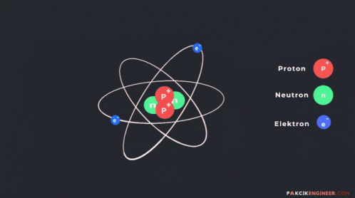

# Atom
An atom is the smallest particle of an element that can exist on its own. In other words, if you have a bar of solid gold, the smallest particle that could exist by itself and still be considered gold would be one atom of gold. 
## Specifications:
I will try to demonstrate how the atom works and what is inside it.

 

## Technologies Used
- HTML5: Used for structuring the web pages and content.
- CSS3: Used for styling and layout of the website.
- JavaScript: Used for interactive features and dynamic content.
- Bootstrap: Utilized the Bootstrap framework for responsive design and pre-built components.
- GitHub Pages: Hosted the website on GitHub Pages for easy deployment and accessibility.

## Languages and Tools:

  
 

